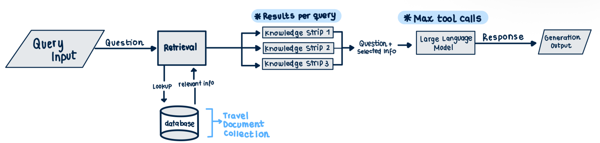

# ✈️ TravelRAG A Retrieval-Augmented Travel Assistant

## Introduction and Problem Statement
I have always enjoyed traveling and getting to discover new places. What I don't enjoy as much is the planning. From a personal standpoint, travel planning has always felt fragmented to me. Particularly, it feels hard to know where to start. The information is spread across blogs, PDFs, guides, review sites, and youtube videos which makes it difficult to get clear and reliable answers that truly target my needs and aspirations as a traveler. With the rise of AI and chatbots like ChatGPT and Gemini, it seemed like there finally was a centralized place to start, but instead, I found myself getting generic answers and even fake information (given often hallucinations) leading to surface-level advice without grounding responses in real sources. Faced with this issue, I decided to build TravelRAG, which serves as a retrieval-augmented travel assistant that provides source-grounded travel recommendations using modern NLP techniques.  The benefit of opting for this model, is that rather than relying purely on a language model’s internal knowledge (which is exactly the issue I found with traditional chatbots), TravelRAG retrieves relevant information from a curated travel document collection and uses that context to generate accurate responses.

## Project Overview
### What Is This App?
TravelRAG Assistant is an interactive assistant that allows users to ask travel-related questions and receive responses grounded in real sources like:
- Travel guides from National Geographic
- Destination overviews from professional advisors
- Travel tips and recommendations from recognized travel Bloggers

The app used a Retrieval-Augmented Generation (RAG) pipeline built with CrewAI, DuckDB, and Sentence Transformers, ensuring responses are informed by relevant source material rather than generic knowledge.

### Methodology
**1. Curating Travel Database:**
The first step to construct the agent was to gather sources that would inform the chatbot. These documents were gathered from trusted and diverse travel resources to have sufficient information that caters to the needs of different travelers. In order to do this, the main focus was on sources that recommended destinations, as the starting point often feels like the hardest decision to make. To do this, I included general recommendations like articles recommending top travel destinations for 2026 as well as destinations ideal for specific seasons, different types of travelers (luxury, backpacking, foodies, group trips), while always seeking to have geographic diversity (including recommendations from every continent). Below is the full list of documents that were used. Each document is then broken into smaller text chunks so that the system can retrieve specific, relevant passages instead of entire articles.

**2. Building Vector DB** 
Each text chunk is then converted into a numerical embedding using a Sentence Transformer model. The role that these embeddings play is gathering the meaning of the sentences in the text, rather than just capturing the keywords and containing them in a vector. This said, each chuck receives a vector in the embedding space, which allows similar chunks to be closer together (which makes the retrieval process easier as queries can retrieve chunks based on the distance between them). 
The embeddings are stored in a DuckDB vector database, which is used mainly for analytical purposes. DuckDB was chosen because it is lightweight, fast, and easy to integrate into a Streamlit application.

**3. Retrieval Process**
When a user submits a query, it is embedded using the same sentence transformer model that was used for the documents in the database. The retrieval process then looks up in the database the most relevant shape comparing the similarity of vectors between the query and the stored endings. The depth of this process can be configured by the user by altering the results per query in the left hand side of the app. Essentially, the result per query allows the user to define the top k number of chunks that will be considered to generate an answer.  By default the app will show the 10 chunks with the highest similarity to the query. Considering this:
If user sets results per query < 10 → Top 10 most similar chunks will still be printed in “View Sources” however only k chunks are considered (where k<10)
If the user sets results per query < 10 → Only the top 10 most similar chunks will be printed in “View Sources”, however k chunks are considered in the output (where k>10).

**4. Agent Configuration**
Once top documents  are selected they are passed to the CrewAI based agent which is responsible for generating the final response. This agent was intentionally configured to serve the purpose of being a travel centered RAG, with a defined role, goal and backstory to guide its behaviours:
- Role → _“Travel Destination Recommendator Assistant”_: The agent is a guide that allows users to explore and compare travel destinations using curated materials without committing to detailed planning or logistics.
- Goal → _“Answer questions about travel destination recommendations using the database to build ideal itineraries”_: The primary goal of the agent is to help users overcome what I consider the hardest part of planning: choosing a destination. By offering evidence-based recommendations, the system looks to identify suitable travel destinations that fit their interests and based on these recommendations, suggest high-level itineraries that illustrate how a trip might be structured. It is important to highlight that this system is not designed to generate fully detailed travel plans with bookings, schedules, or logistics, but rather to serve as an informed starting point in the travel planning process.
- Backstory → _“You are a travel expert who has access to a database with content about travel destinations. You want to provide a variety of options in terms of destinations depending on the user preferences and build ideal high level itineraries to fit traveler needs”_: The backstory defines this agents as a travel expert with access to a curated database of travel content, which reinforce evidences based recommendation and discourage false or overly detailed outputs.

**5. Response Generation**
Once the agent receives the selected top-k chucks and the user query, it proceeds with response generation by synthesizing the retrieved information into a natural language answer. During this process, the agent evaluates the provided information, identifies relevant patterns and integrates them into one coherent response that aligns with the user's question.  To regulate this, the user can use the Max tool called constraint to limit the number of extra actions that the agent can take when generating an answer. This limits the helper functions the agent is allowed to use, which avoid long or repetitive reasoning, speeds up response time and maintains the output relevant and clear, which aligns with the TravelRAG’s goal. 

### Architecture Diagram
The TravelRAG built follows the following architecture:
backend/images/IMG_0778.png

**1. Query Input:** User enters a travel related question (destination ideas, seasonal recommendations, etc)

**2. Retrieval of Relevant Information:** Considering the question, relevant information is looked up in a previously built database (duckdb database) . Identified chucks with similar semantics are selected.  

**3. Selected Knowledge Strips:** The chunks are sorted in descending similarity scores. Only k results per query (as set by the user) are passed to the Large Language model (CrewAI based) along with the questions. 

**4. Large Language Model:** The agent previously configured receives x # results per query (user defined), and questions to generate answers. It uses x # of max tools (user selected) as extra functions in the generation process. 

**5. Generation Output:** The answer to the query is outputted in proper natural language, backed up by sources. Output also includes the sources from the database used and their similarity score in respect to the question. 

### Installation
- To run the app locally, follow the steps below:
- Open terminal inside main portfolio (MEJIA-Language-Processing)
- Run ‘pip install pipreqs’ command
- Navigate to the FINAL-Project folder:
    - ‘cd MEJIA-Language-Processing/MEJIA_LPP_Rag/FINAL-Project’
- Run ‘ls’ command to check you are in the right folder (should be FINAL-Project)
- Run ‘pipreqs’ command to create text file in folder
- Run ‘streamlit run app.py’ to open streamlit browser

### Link to deployed version
https://silvanamejia1-language-porcessing-in-practice--app-guo92y.streamlit.app/

